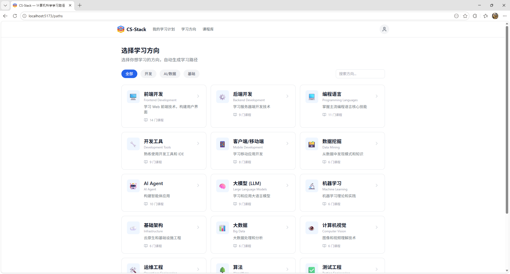
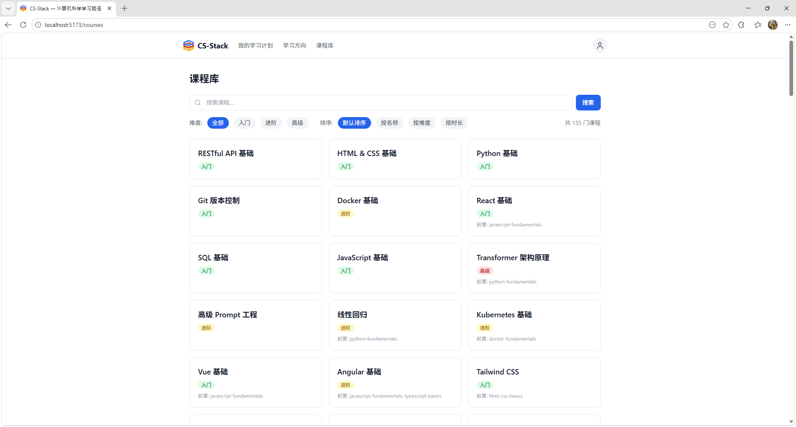
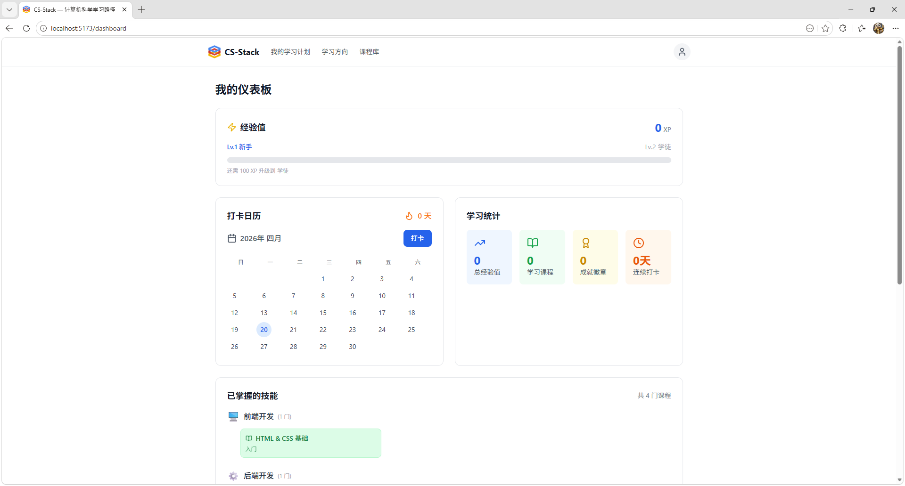
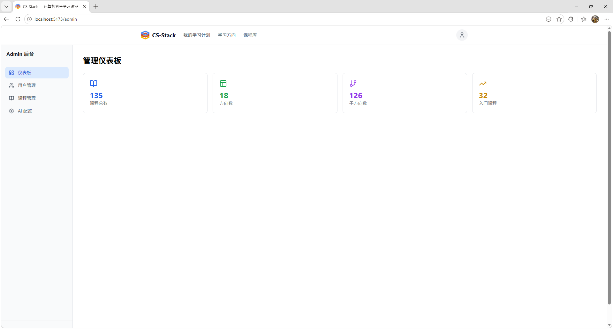

# CS-Stack — 计算机科学学习路径平台

> 面向学生和技术自学者的系统化计算机科学学习平台

## 🌟 项目简介

CS-Stack 是一个基于 ACM/IEEE CS2023 标准的计算机科学学习路径平台，提供课程库、技能树/路线图、学习方向选择器、进度追踪、激励机制和 AI 管理后台。

**核心价值**：
- 📚 **18 个专业方向，122 个子方向** — 涵盖前后端、AI、安全、大数据等领域
- 🎯 **80/20 学习法则** — 优先掌握核心知识点，快速建立系统认知
- 🌳 **可视化技能树** — 展示课程依赖关系，规划学习路径
- 🏆 **激励机制** — 经验值、成就徽章、连续打卡
- 🤖 **AI 管理后台** — Admin 通过 AI API 持续发现并添加新课程

## 📸 功能截图

### 我的学习计划


### 学习方向



### 课程详情



### 仪表盘



### 管理后台



## 🏗️ 技术架构

```
┌─────────────────────────────────────────────────┐
│                   React Frontend                 │
│  (Vite + TypeScript + TailwindCSS)               │
└───────────────────┬─────────────────────────────┘
                    │ REST API (JSON)
                    ▼
┌─────────────────────────────────────────────────┐
│                  FastAPI Backend                 │
│  - 课程 API / 用户 API / 进度 API / AI API       │
│  - JSON 文件持久化                                │
└───────────────────┬─────────────────────────────┘
                    ▼
┌─────────────────────────────────────────────────┐
│              JSON File Storage                   │
└─────────────────────────────────────────────────┘
```

**技术栈**：

| 层级 | 技术 |
|------|------|
| 前端 | React 18 + Vite + TypeScript + TailwindCSS |
| 后端 | Python 3.11+ + FastAPI + Pydantic |
| 存储 | JSON 文件 |
| 认证 | JWT (python-jose) |
| AI | OpenAI API / Claude API |

## 📂 项目结构

```
CS-Stack/
├── backend/                    # FastAPI 后端
│   ├── main.py                 # 应用入口
│   ├── models.py               # Pydantic 数据模型
│   ├── storage.py              # JSON 文件读写层
│   ├── auth.py                 # JWT 认证
│   ├── routes/                 # API 路由
│   │   ├── directions.py       # 方向 API
│   │   ├── subdirections.py    # 子方向 API
│   │   ├── courses.py          # 课程 API
│   │   └── users.py            # 用户 API
│   └── requirements.txt        # Python 依赖
├── frontend/                   # React 前端
│   ├── src/
│   │   ├── api/client.ts       # Axios API 客户端
│   │   ├── types/index.ts      # TypeScript 类型
│   │   ├── pages/              # 页面组件
│   │   ├── App.tsx             # 路由配置
│   │   └── main.tsx            # 入口
│   ├── package.json
│   └── vite.config.ts
├── data/                       # JSON 数据存储
│   ├── directions.json         # 专业方向
│   ├── subdirections.json      # 子方向
│   ├── courses/index.json      # 课程
│   └── users/                  # 用户数据
└── docs/                       # 设计文档与计划
```

## 🚀 快速开始

### 前置条件

- Python 3.11+
- Node.js 18+

### 启动后端

```bash
# 安装依赖
pip install -r backend/requirements.txt

# 启动服务
python -m uvicorn backend.main:app --reload --host 0.0.0.0 --port 8000
```

后端运行在 http://localhost:8000

### 启动前端

```bash
cd frontend
npm install
npm run dev
```

前端运行在 http://localhost:5173

## 📚 专业方向体系

> 按市场需求/使用概率降序排列

| # | 方向 | 子方向数 | 热门程度 |
|---|------|---------|---------|
| 1 | 前端开发 | 7 | ⭐⭐⭐⭐⭐ |
| 2 | 后端开发 | 7 | ⭐⭐⭐⭐⭐ |
| 3 | 编程语言 | 10 | ⭐⭐⭐⭐⭐ |
| 4 | 开发工具 | 9 | ⭐⭐⭐⭐⭐ |
| 5 | 客户端/移动端 | 6 | ⭐⭐⭐⭐ |
| 6 | 数据挖掘 | 6 | ⭐⭐⭐⭐ |
| 7 | AI Agent | 10 | ⭐⭐⭐ |
| 8 | 大模型 (LLM) | 9 | ⭐⭐⭐⭐⭐ |
| 9 | 机器学习 | 6 | ⭐⭐⭐⭐⭐ |
| 10 | 基础架构 | 6 | ⭐⭐⭐⭐ |
| 11 | 大数据 | 6 | ⭐⭐⭐⭐ |
| 12 | 计算机视觉 | 6 | ⭐⭐⭐⭐ |
| 13 | 运维工程 | 6 | ⭐⭐⭐⭐ |
| 14 | 算法 | 7 | ⭐⭐⭐ |
| 15 | 测试工程 | 7 | ⭐⭐⭐ |
| 16 | 自然语言处理 | 6 | ⭐⭐⭐ |
| 17 | 安全 | 6 | ⭐⭐⭐ |
| 18 | 多媒体 | 6 | ⭐⭐ |

## 📝 开发阶段

| Phase | 内容 | 状态 |
|-------|------|------|
| Phase 1 | 基础设施：脚手架、存储层、认证、基础 API | ✅ 完成 |
| Phase 2 | 课程系统：前端展示、详情页、进度追踪 | ✅ 完成 |
| Phase 3 | 方向选择与技能树 | ✅ 完成 |
| Phase 4 | 激励机制 | ⏳ 待开发 |
| Phase 5 | AI 管理后台 | ⏳ 待开发 |
| Phase 6 | 优化与完善 | ⏳ 待开发 |

## 📖 设计文档

- [设计文档](docs/superpowers/specs/2026-04-19-cs-stack-design.md)
- [Phase 1 实施计划](docs/superpowers/plans/2026-04-19-cs-stack-phase1.md)

## 📄 许可证

MIT License
